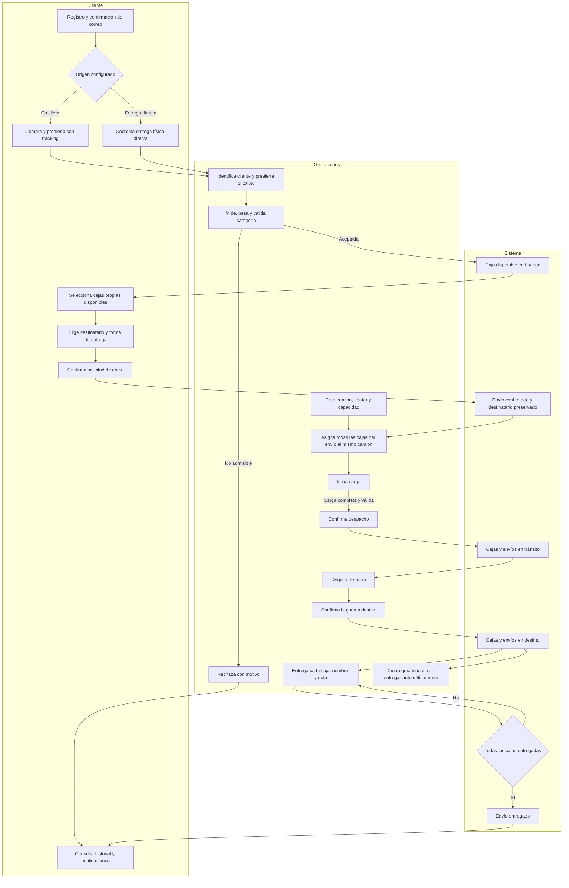
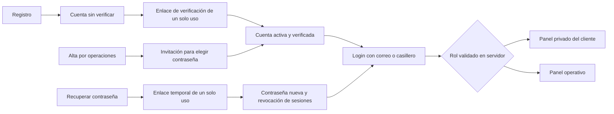
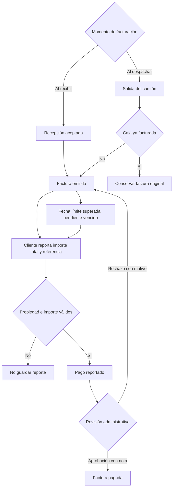
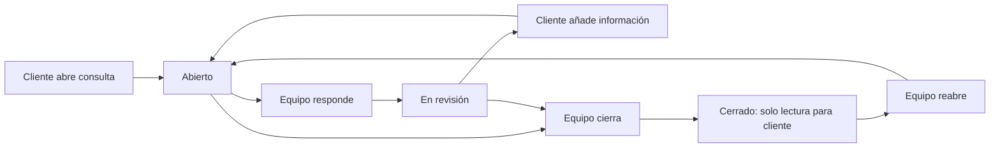

# A&L · Mapa del flujo real

Revisión: 5 de septiembre de 2026. Describe el comportamiento implementado en local; no certifica un despliegue productivo ni servicios externos. Complementa [AUTH-REAL.md](AUTH-REAL.md) y sustituye las descripciones de demo que confundían solicitud, despacho, pago y entrega.

## 1. Principio operativo

Una **caja** es la unidad física. Un **envío** agrupa cajas de un cliente para un destinatario. Un **camión / guía máster** transporta cajas de distintos clientes. Una **factura** documenta los importes; un **reporte de pago** debe revisarse. Un **ticket** conserva una conversación privada con soporte.

No son equivalencias:

- Crear envío ≠ despachar camión.
- Reportar pago ≠ confirmar ingreso bancario.
- Llegar a destino ≠ entregar la caja.
- Cerrar camión ≠ cerrar los envíos o entregar sus cajas.
- Correo en cola ≠ mensaje entregado al destinatario.
- Cotización actual ≠ importe histórico de una factura emitida.

## 2. Mapa principal por responsable



El registro de recepción conserva la identidad de una prealerta existente: mismo ID, código, tracking e historial. Recibirla dos veces se rechaza. Recibir sin prealerta crea una caja nueva. La ruta anterior es el flujo de autoservicio del cliente; también se mantiene la asignación administrativa de cajas sin envío. Esa ruta no crea un destinatario ni un envío automáticamente: el equipo debe coordinar su entrega y no presentarla como una solicitud del cliente.

## 3. Acceso y recuperación



Contraseñas scrypt; sesiones opacas persistidas como hash; cookies protegidas. Desactivar una cuenta revoca su acceso. Las lecturas y acciones verifican rol y titularidad en el servidor, no solo en el menú. No hay acceso administrativo por conocer una URL. El email de acceso no se cambia desde el perfil sin un flujo adicional de verificación.

Los logs automáticos de argumentos de Server Functions y URLs de desarrollo se deshabilitan en `next.config.ts`: podrían registrar contraseñas o tokens de un solo uso. Esto no deshabilita la auditoría de seguridad de la aplicación.

## 4. Estados y efectos

| Acción | Caja | Envío | Camión |
|---|---|---|---|
| Prealerta (solo casillero) | `pre-alertada` | No existe | No asignado |
| Recepción aceptada | `recibida` → `categorizada` → `en-bodega` | No lo crea automáticamente | No asignado |
| Solicitud del cliente | `en-bodega` | `pendiente` → `confirmado` en la misma operación | No asignado |
| Asignación a camión planificado | Sigue `en-bodega`, con `truckId` | `confirmado`, con `truckId` | `planificado` |
| Iniciar carga / añadir caja durante carga | `cargada-en-camion` | `confirmado` | `cargando` |
| Despachar | `en-transito` | `en-transito` | `despachado` |
| Registrar frontera | Sigue `en-transito` | Sigue `en-transito` | `en-frontera` |
| Llegar a destino | `en-destino` | `en-destino` | `en-destino` |
| Cerrar guía máster | Sin cambio | Sin cambio | `cerrado` |
| Entregar una caja | `entregada` | `entregado` solo cuando todas estén entregadas | Sin cambio |

Controles adicionales:

- Un camión vacío no se despacha. Un envío incompleto o repartido entre camiones tampoco.
- La capacidad se controla por categoría; no puede reducirse por debajo de las cajas asignadas.
- Antes de salir, retirar una caja cargada la devuelve a bodega. Se elimina el vínculo del envío con el camión cuando no quedan cajas de ese envío asignadas.
- La caja no se entrega antes de llegar a destino. La constancia guarda nombre, nota, fecha e ID del operador; no incluye firma digital.
- La sobrescritura de categoría exige motivo y una categoría que realmente admita medidas y peso.
- Con `excessPolicy=rechazo`, exceder la categoría de una prealerta exige rechazo. Sin categoría estimada, se calcula una admisible. Exceder la máxima exige rechazo en cualquier modalidad.
- El rechazo puede registrarse también por daño físico, no solo por dimensiones. No genera factura de recepción.
- `excede-categoria` existe en el dominio para datos heredados. La recepción actual resuelve aceptación o rechazo; no hay un circuito completo de recargos ni una pantalla de regularización de estados heredados.

## 5. Facturación y pagos: flujo paralelo



La factura conserva sus líneas y precios de emisión. Si se factura al recibir, puede no existir aún un envío: `boxIds` es el vínculo de facturación y `shipmentId` puede quedar vacío. Un documento de despacho puede agrupar cajas de varios envíos del mismo cliente; su `shipmentId` es una referencia auxiliar, no una relación exclusiva. Para conocer el saldo vinculado a una caja se priorizan los `boxIds` explícitos.

Los pagos cubren el total exacto en USD, con precisión de centavos. No se implementan abonos parciales, conciliación bancaria automática, tarjeta, devolución ni cobro automático de seguro/última milla. Una nota administrativa no reemplaza la comprobación bancaria.

La bandeja calcula facturas vencidas por fecha para documentos `emitida` o `vencida`; no necesita un job que cambie todas las filas a `vencida`. Los borradores no forman parte del saldo exigible. Un reporte en revisión se atiende como pago pendiente de revisión. Actualmente una deuda no bloquea automáticamente el despacho o la entrega: introducir esa regla requiere definir la política comercial.

## 6. Soporte



El equipo puede conservar Abierto al responder, o cerrar una consulta con una respuesta. Las actualizaciones administrativas comparan la versión del ticket (`updatedAt`) para rechazar una edición obsoleta. El cliente solo escribe en tickets propios no cerrados. No hay asignación individual, SLA automático o chat en tiempo real. Las respuestas se consultan al actualizar la conversación.

## 7. Matriz de comunicación

| Evento | Panel del cliente | Email |
|---|---|---|
| Registro, invitación, recuperación | Acceso condicionado a verificación | Enlace de un solo uso |
| Prealerta, recepción / rechazo | Registro y notificación | En cola |
| Solicitud de envío | Confirmación y notificación | En cola |
| Emisión de factura | Factura y notificación | Incluido en el flujo de recepción / despacho, no un correo separado por cada factura |
| Avance o cierre de camión | Estados y notificación | En cola |
| Reporte, aprobación o rechazo de pago | Factura y notificación | En cola |
| Entrega individual | Historial y notificación | En cola |
| Ticket nuevo | Ticket y notificación | En cola al cliente |
| Respuesta administrativa / cambio de estado | Ticket y notificación | En cola al cliente |
| Respuesta del cliente | Mensaje y pendiente de soporte | Sin email automático al equipo |

Las acciones operativas y su cola de correo se guardan en una transacción. El worker de Resend procesa reintentos. `queued`, `sent` y `delivered` son resultados diferentes; la aceptación por Resend no garantiza entrega. Localmente se usa **preview**: no se envían mensajes externos. Ver [AUTH-REAL.md](AUTH-REAL.md) para dominio, URL pública, rotación de clave, webhook y worker.

## 8. Herramientas de gestión

| Ruta | Uso |
|---|---|
| `/admin` | Indicadores, accesos a tareas y guías recientes |
| `/admin/pendientes` | Prealertas, envíos confirmados, pagos, soporte y entregas; prioridad y antigüedad |
| `/admin/recepcion` | Alta o conciliación de prealertas, medidas, categoría y rechazo |
| `/admin/bodega` | Inventario y asignación |
| `/admin/camiones` | Capacidad, chofer, carga y avances de guía máster |
| `/admin/entregas` | Recepción física individual e historial |
| `/admin/facturas` | Desglose y resolución de reportes de pago |
| `/admin/clientes` | Datos del cliente, direcciones, destinatarios, acceso y notas |
| `/admin/soporte` | Conversación, revisión, cierre y reapertura |
| `/admin/correos` | Cola, estado y previsualización local autorizada |
| `/admin/configuracion` | Flujo y tarifas guardados juntos de forma transaccional |

## 9. Demostración pública

- Página completa: `/como-funciona`. También integrada en `/#proceso`.
- Tres recorridos: viaje de una caja, facturación y pagos, atención y soporte.
- Cada etapa muestra **Cliente / Operaciones / Sistema**, estados, condición de seguridad y comunicación.
- Parte de la configuración actual. Cambiar origen o momento de facturación en la demostración solo cambia estado local de la interfaz: no hay acciones de servidor, escrituras ni correos.
- La guía pública no carga cuentas, tokens, cajas o direcciones reales.
- Fuente de contenido: `src/lib/domain/flow-guide.ts`. Interfaz: `src/components/marketing/flow-explorer.tsx`.
- Las pruebas comparan los estados de la guía con los estados reales del dominio y verifican diferencias por configuración. Cualquier cambio operativo debe revisar la guía y este documento.

### Guion breve de demostración

1. Mostrar la recepción y señalar que una prealerta no equivale a una caja recibida.
2. Seleccionar Confirmar envío: sigue confirmado, no está en tránsito.
3. Seleccionar Despachar y Frontera: distinguir estado del camión y estado de sus cajas.
4. Mostrar Destino y Entrega: explicar la entrega individual y el cierre independiente del camión.
5. Cambiar a Pagos y alternar facturación al recibir / al despachar. Mostrar la revisión y el rechazo.
6. Cambiar a Soporte: mostrar respuesta, seguimiento y cierre.
7. Aclarar que es un recorrido explicativo y que los correos locales están en preview.

## 10. Discrepancias corregidas y límites explícitos

Corregido: relaciones caja/envío/camión; recepción duplicada de prealertas; entrega individual; soporte bidireccional; protección de pagos; categoría manual fuera de límites; saldo que incluía borradores; enlaces de pendientes; tarifas estáticas en ilustraciones del inicio; copia pública que confundía despacho con solicitud y prometía siempre domicilio; menú público ausente en tamaños intermedios; configuración parcialmente guardada.

Los recargos automáticos no cuentan con importes ni circuito de aprobación: se retiran del selector y el servidor rechaza activarlos. No se inventa un precio. `packingMode` describe al responsable físico, no un módulo automatizado de empaque. La cobertura final, datos de contacto y tiempos continúan pendientes de confirmación comercial.

Fotos y comprobantes todavía registran nombres, no archivos persistentes. No hay firma digital de entrega, GPS en vivo ni integración aduanera. Las entidades operativas se almacenan como documentos MySQL con bloqueo transaccional: para alto volumen se requiere normalización, paginación y pruebas de carga. No se alteran automáticamente registros históricos para adivinar relaciones faltantes; los controles los bloquean cuando impiden una operación segura.

## 11. Evidencia técnica y pruebas

Fuentes de verdad:

- `src/lib/domain/state-machine.ts`: transiciones y cascadas.
- `src/lib/auth/admin-actions.ts`: recepción, asignación, facturación y aprobación.
- `src/lib/auth/client-actions.ts`: solicitud, reporte, datos propios y soporte.
- `src/lib/auth/operations-actions.ts`: soporte administrativo y entrega.
- `src/lib/services/logistics.ts`: filtros por rol y titularidad.
- `src/lib/db/mutation.ts` y `store.ts`: transacción y rollback de validaciones fallidas.
- `src/lib/services/email.ts`: cola y worker.

Verificación local:

```powershell
npm test
npm run test:integration
npm run lint
npm run build
```

La integración crea y elimina exclusivamente una base temporal `ayl_test_<uuid>`. Prueba el trayecto completo, permisos cruzados, pagos inválidos, concurrencia de soporte y rollback; no llena la base operativa con datos ficticios ni envía correos reales.
